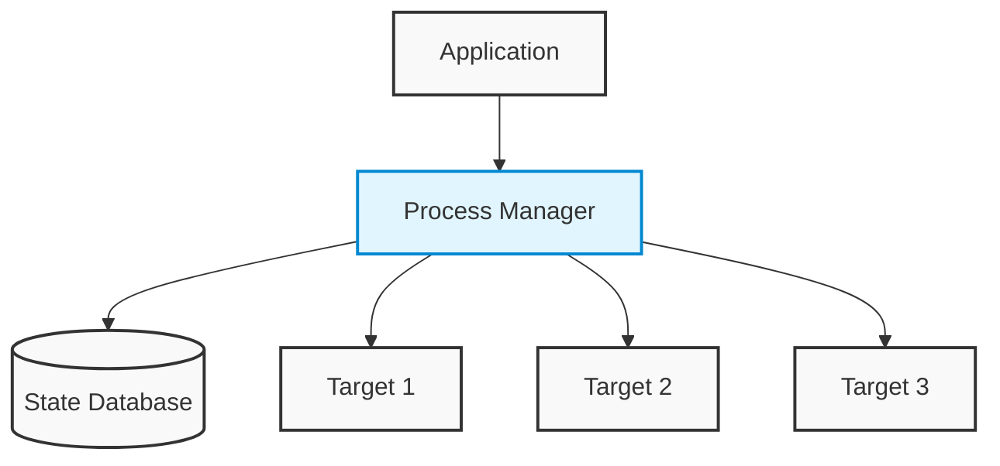
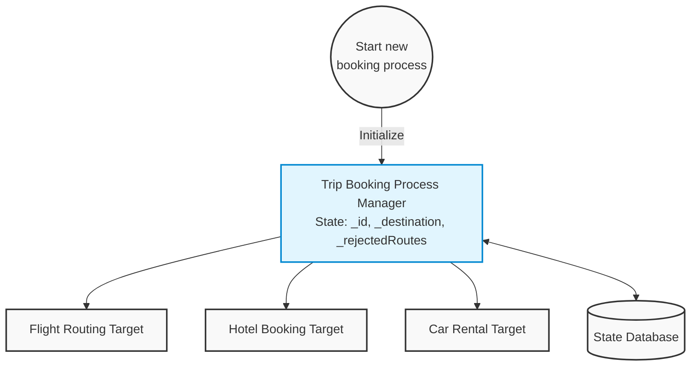
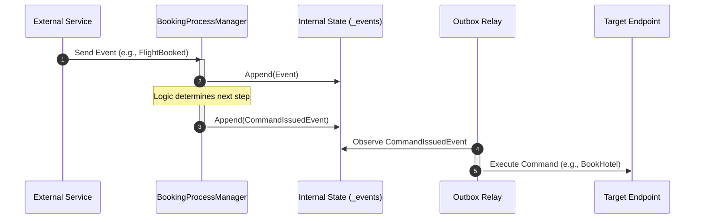
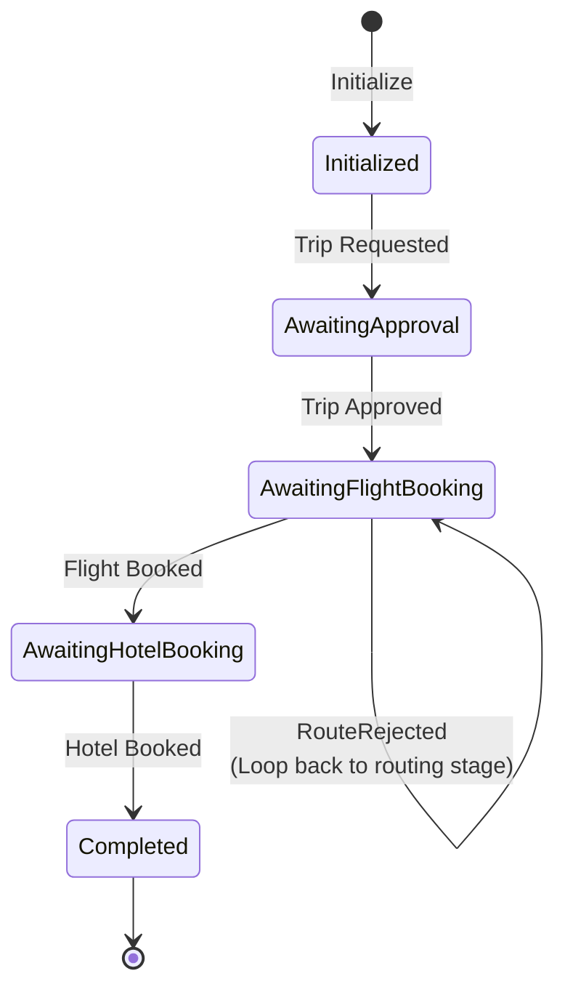
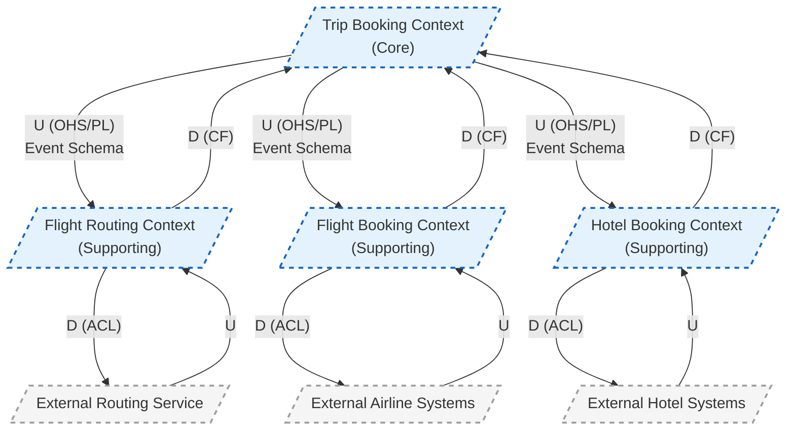

# Booking Process Manager Walkthrough

This document visualizes the operation of the `BookingProcessManager` using architectural flow diagrams, sequence diagrams, and state machine diagrams.

## 1. The Architectural Flow

These diagrams illustrate the structural relationship between the code and the system.

### Generic Pattern (Figure 9-14)
The Process Manager acts as a central processing unit sitting between the application and multiple external services. It is the sole component responsible for communicating with the state database.

### Specific Implementation (Figure 9-15)
This diagram maps directly to the implementation details. The `Initialize` method starts the process, tracking state variables like `_id`, `_destination`, and `_rejectedRoutes`, and issuing commands to various targets.

## 2. The Logic Sequence

This sequence diagram illustrates how the `Process` method executes in a distributed environment when an event occurs.

## 3. The State Transition

The Process Manager acts as a persistent object that "wakes up" to handle events based on its saved history. This diagram shows its lifecycle and loop-back mechanisms.

## 4. Code Architecture and Design

The implementation of the `BookingProcessManager` is designed around **Hexagonal Architecture (Ports and Adapters)**, ensuring the core business logic is completely isolated from infrastructure concerns like HTTP APIs, database implementations, and message brokering.

### Decoupled Components
The system is divided into highly isolated microservices:
- **`trip-booking-manager` (The Core):** Maintains the `ProcessState` and implements the Transactional Outbox pattern.
- **Worker Services:** `flight-routing-service`, `flight-booking-service`, and `hotel-booking-service`. These are stateless background workers that only know how to consume specific RabbitMQ commands and publish events in response.
- **`api-gateway`:** A REST API entrypoint. It does not touch the state database directly. Instead, it acts as a proxy, forwarding requests to the manager's driving port to enforce bounded contexts.

### The Transactional Outbox Pattern
To prevent partial failures (e.g., saving state to Postgres but crashing before publishing to RabbitMQ), the `trip-booking-manager` leverages the Transactional Outbox pattern.
- **Atomicity:** When a domain action occurs, the updated `process_state` and a new `outbox_events` record are saved to the database in a single transaction.
- **Relay Worker (`SKIP LOCKED`):** A background thread constantly polls the `outbox_events` table for unpublished events. It uses a Postgres `FOR UPDATE SKIP LOCKED` query, which provides robust concurrency control. This allows the system to be scaled to multiple replicas safely without workers deadlocking or duplicating message publishing.

### State Hydration
When the `trip-booking-manager` receives an event from RabbitMQ (like `FlightBookedEvent`), the infrastructure layer extracts the `bookingId`, queries the Postgres database to retrieve the current state, and reconstructs (hydrates) the Process Manager in memory before passing the event payload directly into the pure domain logic.

## 5. DDD Context Diagram

