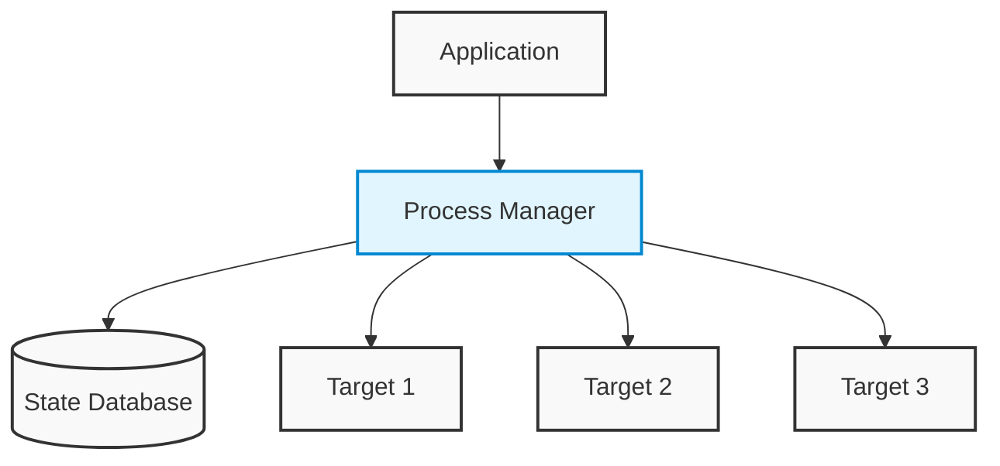
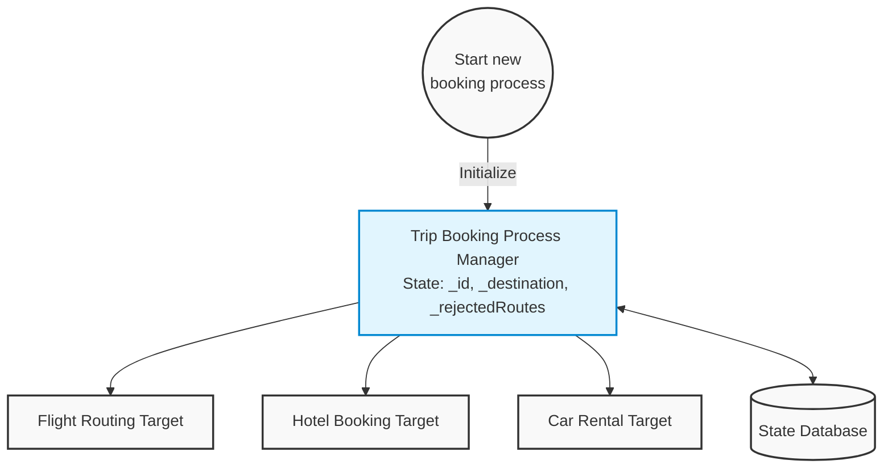
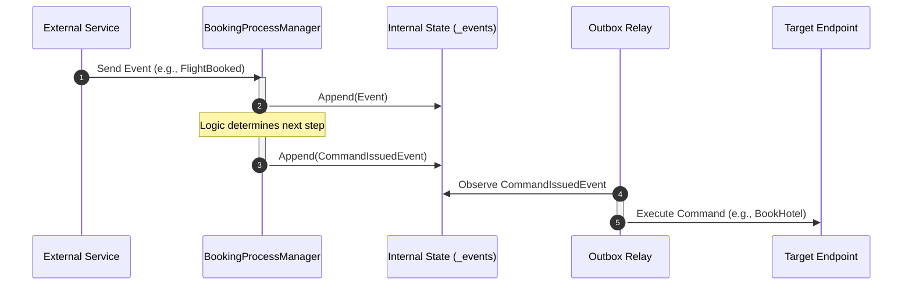
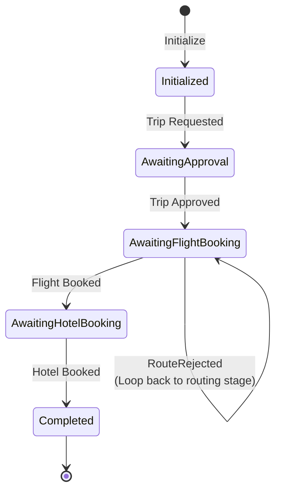

# Booking Process Manager Walkthrough

This document visualizes the operation of the `BookingProcessManager` using architectural flow diagrams, sequence diagrams, and state machine diagrams.

## 1. The Architectural Flow

These diagrams illustrate the structural relationship between the code and the system.

### Generic Pattern (Figure 9-14)
The Process Manager acts as a central processing unit sitting between the application and multiple external services. It is the sole component responsible for communicating with the state database.

### Specific Implementation (Figure 9-15)
This diagram maps directly to the implementation details. The `Initialize` method starts the process, tracking state variables like `_id`, `_destination`, and `_rejectedRoutes`, and issuing commands to various targets.

## 2. The Logic Sequence

This sequence diagram illustrates how the `Process` method executes in a distributed environment when an event occurs.

## 3. The State Transition

The Process Manager acts as a persistent object that "wakes up" to handle events based on its saved history. This diagram shows its lifecycle and loop-back mechanisms.

